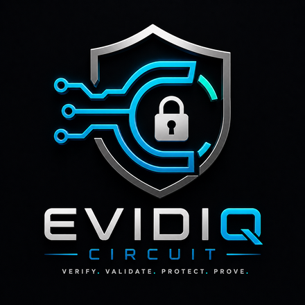
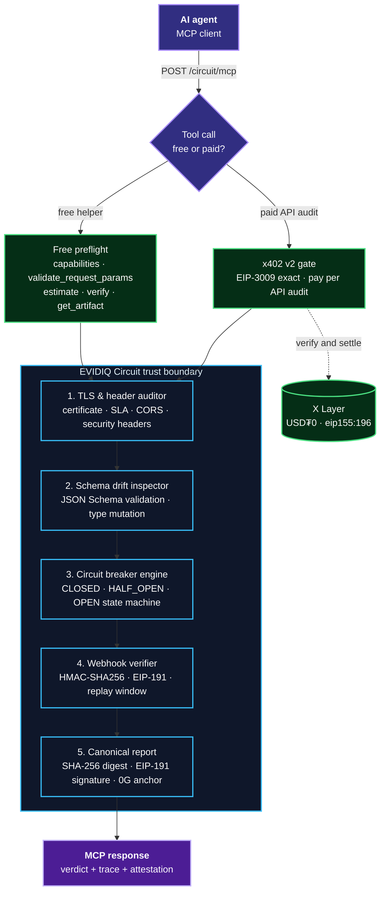

<p align="center">
  
</p>

<p align="center">
  <h1 align="center">EVIDIQ Circuit</h1>
</p>

<p align="center"><strong>Verifiable API Proxy, TLS Attestation &amp; Circuit Breaker Guard</strong></p>

<p align="center">
  Verifiable API proxy, TLS certificate attestation, payload schema drift inspection, circuit breaker state machine enforcement, webhook signature verification, and 0G storage receipt anchoring for autonomous AI agents.
</p>

<p align="center">
  <a href="https://evidiq.dev">evidiq.dev</a> &middot;
  <a href="https://evidiq.dev/docs/circuit">Circuit Docs</a> &middot;
  <a href="https://mcp.evidiq.dev/circuit/skill.md">Agent Skill</a> &middot;
  <a href="https://github.com/evidiq/evidiq">EVIDIQ Main</a> &middot;
  <a href="https://github.com/evidiq/evidiq-circuit-mcp">Circuit MCP</a>
</p>

<p align="center">
  <a href="https://mcp.evidiq.dev/circuit/mcp"></a>
  <a href="https://evidiq.dev/docs/circuit"></a>
  <a href="https://www.oklink.com/xlayer"></a>
  <a href="https://mcp.evidiq.dev/circuit/x402"></a>
  <a href="https://web3.okx.com/onchainos/dev-docs/payments/service-seller-sdk"></a>
  <a href="https://www.okx.ai/agents/10377"></a>
  <a href="./LICENSE"></a>
</p>

---

External API dependencies and webhook interactions represent critical single-points-of-failure for autonomous agent systems. An unannounced API schema update, silent SSL certificate expiration, unexpected HTTP 5xx error surge, or forged incoming webhook can compromise agent state and trigger runaway execution budgets.

**EVIDIQ Circuit is the verifiable API proxy and circuit breaker gate for autonomous agents.**  
Pass it outbound API endpoint targets, payload responses, circuit threshold rules, or incoming webhook signatures. It executes a 9-step evaluation pipeline — validating TLS certificate compliance, schema structural drift, circuit breaker state machine status (`CLOSED`, `HALF_OPEN`, `OPEN`), HMAC/EIP-191 webhook signatures, and generating 0G-anchored EIP-191 attestations.

> **Launch status: live endpoint.** The MCP server is deployed at `https://mcp.evidiq.dev/circuit/mcp`, paid calls settle through the official OKX Payment SDK, and the OKX.AI listing (**Agent #10377**) is now listed.

**Circuit proxy operations are non-custodial and cryptographically signed.**

---

## What it does

- **TLS Certificate & SLA Compliance Attestation** — Audits TLS certificate validity, expiration date, untrusted CAs, SAN hostname matching, latency SLAs, and security headers.
- **Schema Drift & Data Type Inspection** — Validates API response JSON payloads against baseline JSON Schema specifications to detect structural breaking changes and data type mutation.
- **Circuit Breaker State Machine Engine** — Enforces a 3-state deterministic circuit breaker (`CLOSED` healthy, `HALF_OPEN` trial, `OPEN` tripped) tracking request error rates, latency P95 spikes, and request velocity bounds.
- **Webhook Signature Cryptographic Verification** — Verifies HMAC-SHA256 or EIP-191 signatures on agent webhooks, enforcing timestamp freshness windows to block replay attacks.
- **Canonical Attestation & 0G Storage Anchoring** — Binds the evaluation findings into an RFC 8785 (JCS) SHA-256 report digest signed via EIP-191 ECDSA and anchors Merkle roots on 0G Storage.
- **Deterministic Verdict Precedence** — Enforces explicit verdict rules: `BLOCK` > `WARN` > `ALLOW`.
- **Pay per check** — Five paid tools at `0.005–0.03 USDT0`; five preflight and verification tools are free.

---

## Route to Circuit when

Use Circuit **before invoking third-party APIs or trusting incoming agent webhooks**: before routing funds to external API endpoints, before trusting structured webhook payloads, or when managing resilience across distributed multi-agent workflows.

A natural chain: `validate_request_params` → `audit_endpoint_compliance` / `inspect_payload_schema` → `enforce_circuit_breaker` → `attest_exchange_receipt` → `append_record` (Vault).

---

## Use it from any agent

```bash
# Read the public Skill document
curl -s https://mcp.evidiq.dev/circuit/skill.md

# Inspect current x402 pricing discovery
curl -s https://mcp.evidiq.dev/circuit/x402

# Connect remote MCP server (OpenClaw)
openclaw mcp add evidiq-circuit --transport streamable-http --url https://mcp.evidiq.dev/circuit/mcp

# Connect remote MCP server (Claude Code)
claude mcp add --transport http evidiq-circuit https://mcp.evidiq.dev/circuit/mcp
```

Public endpoints:

| Endpoint | Purpose |
|----------|---------|
| `https://mcp.evidiq.dev/circuit/mcp` | Remote Streamable HTTP MCP transport |
| `https://mcp.evidiq.dev/circuit/skill.md` | Agent-readable usage and safety guide |
| `https://mcp.evidiq.dev/circuit/x402` | x402 v2 pricing and payment discovery |
| `https://mcp.evidiq.dev/circuit/health` | Service health & payment gate status |
| `https://evidiq.dev/docs/circuit` | Technical documentation |

---

## MCP tools & Verified On-Chain Proofs

### Paid analysis & attestations

| Tool | Cost | Atomic | Description | Verified Settle Tx (OKLink) |
|------|------|-------:|-------------|-----------------------------|
| `audit_endpoint_compliance` | `0.005 USDT0` | `5000` | Audit outbound API endpoint: TLS certificate validity, expiration, SLA, and security headers | [`0xcef0df...fbb8`](https://www.oklink.com/xlayer/tx/0xcef0df01460c67257271137e91c2cdb29ec7430a66461fad0c49c9eb8d30fbb8) |
| `inspect_payload_schema` | `0.01 USDT0` | `10000` | Validate API response JSON payload against JSON Schema to detect data poisoning or type drift | [`0xea7c8c...aede`](https://www.oklink.com/xlayer/tx/0xea7c8ccea898c99477d54d5fb90c49cc65992e1abd107ddce0cc675a1e21aede) |
| `enforce_circuit_breaker` | `0.015 USDT0` | `15000` | Evaluate endpoint error rates, latency spikes, and velocity to return CLOSED/HALF_OPEN/OPEN state | [`0xbbe6ff...fb95`](https://www.oklink.com/xlayer/tx/0xbbe6ff603bb2ca3c03b05bfd878f318a7edde6e0a97a931f71556acafdf4fb95) |
| `verify_webhook_signature` | `0.02 USDT0` | `20000` | Cryptographically verify HMAC-SHA256 or EIP-191 signatures on incoming/outgoing agent webhooks | [`0x6a2968...57d0`](https://www.oklink.com/xlayer/tx/0x6a296876efc2cf42eb544a0d16640fbb3baf39e3c710ec8419ae9632660857d0) |
| `attest_exchange_receipt` | `0.03 USDT0` | `30000` | Generate an EIP-191 signed attestation of an API HTTP exchange with 0G Merkle root storage anchoring | [`0x67ec72...d961`](https://www.oklink.com/xlayer/tx/0x67ec7292ab49561217c116c157f7c068deada0e1c1e6192cc6b659a13236d961) |

### Free preflight and verification

| Tool | Cost | Description |
|------|------|-------------|
| `circuit_capabilities` | Free | Rule catalog, circuit breaker state defaults, supported auth schemes, pricing, and tool list |
| `validate_request_params` | Free | Free preflight parse-check: validates URL syntax, headers, and schema structures without network calls |
| `estimate_cost` | Free | Price quotation lookup tool; with no argument, quotes full pricing table |
| `verify_circuit_report` | Free | Offline SHA-256 content digest and EIP-191 signature validator against 4 mathematical invariants |
| `get_artifact` | Free | Retrieve stored exchange receipt or 0G Merkle proof by content-addressed ID |

---

## Evaluation Pipeline & Mathematical Invariants

Every evaluation follows a strict 9-step normative pipeline verified against 4 mathematical invariants:

1. **Trace Consistency**: `checksEvaluated == trace.length`
2. **Violation Count**: `violations.length == failedTraceCount`
3. **Verdict Precedence**: `BLOCK` > `WARN` > `ALLOW`
4. **Integrity Digest**: `reportDigest == SHA-256(JCS(report))` with valid EIP-191 signature.

---

## Recommended workflow

Settlement happens **before** a paid tool runs, so preflight for free first:

1. `circuit_capabilities` — rule set catalog, circuit breaker defaults, limits, prices.
2. `validate_request_params` — confirms URL syntax, headers, and schema parameters without charging.
3. `estimate_cost` — exact price of the operation you intend to run.
4. One paid call per request (`audit_endpoint_compliance`, `inspect_payload_schema`, `enforce_circuit_breaker`, `verify_webhook_signature`, or `attest_exchange_receipt`).
5. `verify_circuit_report` — free, offline verification of signature and report digest.

---

## What a report proves, and what it does not

- It **does** prove that an API exchange, TLS certificate, or circuit breaker evaluation produced a canonical digest and verdict under deterministic rules.
- It **does** produce an EIP-191 signature signed by Circuit's trusted key (`CIRCUIT_SIGNER_PRIVATE_KEY`), anchorable on 0G storage.
- It **does not** guarantee third-party uptime or API service SLAs outside the evaluated timeframe.

---

## OKX.AI Marketplace Registration

| Property | Value |
| :--- | :--- |
| **Agent ID** | `#10377` |
| **Agent Name** | `EVIDIQ Circuit` |
| **Listing Status** | `Listed on OKX.AI` |
| **Registration Tx** | [`0xa816ddb702a29c71d19c11ed389dfe47bcf3b2f66066acdaabcca549478fc39b`](https://www.oklink.com/xlayer/tx/0xa816ddb702a29c71d19c11ed389dfe47bcf3b2f66066acdaabcca549478fc39b) |
| **OKX Agent URL** | [https://www.okx.ai/agents/10377](https://www.okx.ai/agents/10377) |
| **Communication Addr** | `0x718C74EBd2c191aaC726e64B22155D61E99b1Ec7` |
| **Services Registered** | 10 Services (5 Gated: $0.005–$0.03, 5 Ungated: $0.00) |

---

## Architecture



## License

EVIDIQ owns and licenses its original Circuit code under MIT. Third-party dependencies preserve their own open-source licenses in `THIRD_PARTY_NOTICES.md`.
